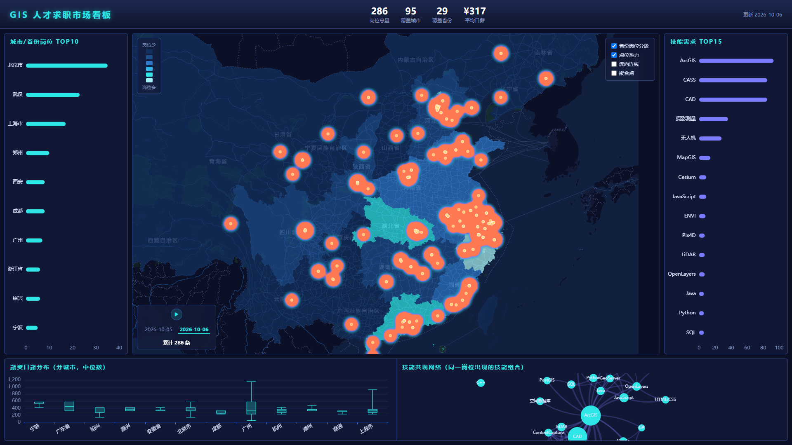
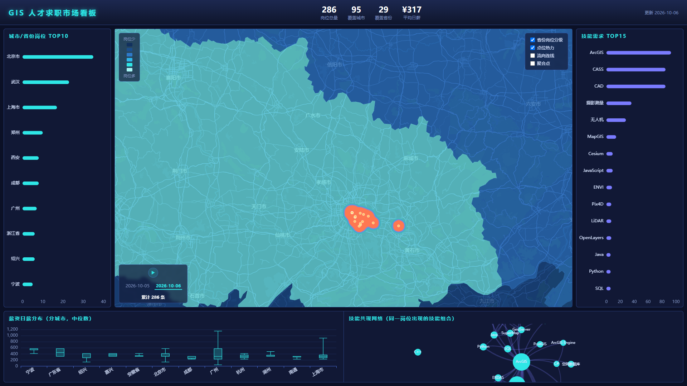

# GIS 人才求职市场可视化大屏

基于 **286 条**（持续采集中）真实 GIS/测绘/遥感岗位数据的求职市场看板：
PostGIS 空间数据库 → Express API → 自托管 OSM 矢量瓦片底图 → AntV L7（WebGL）时空可视化，
一屏看清**地信岗位在哪、要什么技能、给多少钱**。

## 全国视角（带省级地名标注）



## 放大到城市级（地名逐级浮现 + 道路网）



## 在线演示

- **静态版**：[https://luming606.github.io/gis-job-dashboard/](https://luming606.github.io/gis-job-dashboard/)
  （数据随采集批次更新；纯静态部署自动回退内置引擎底图）
- **本地全栈版**：自托管矢量瓦片底图 + 全部功能，见下方「快速开始」

## 功能

- **自托管底图**：全国 OSM 数据切片成 442 万矢量瓦片，MapLibre 引擎渲染，深色主题，
  地名按缩放级别逐级浮现（省 → 市 → 区县），完全自主可控、无第三方地图 API 依赖
- **省级分级统计图**：岗位越多颜色越深（服务端聚合 + 省界 GeoJSON join）
- **点位热力图**：WebGL 核密度渲染，看清城市内部聚集（光谷、张江…）
- **流向连线**：各城市向产业集聚地的岗位规模弧线（示意语义，见数据说明）
- **聚合点**：可点击查看每个岗位的公司/薪资/技能
- **省份下钻**：点击省面弹出该省岗位总量、平均日薪、城市分布、热门技能
- **时间线动画**：按采集日期重放岗位"生长"过程
- **技能需求榜 + 技能共现网络**：市场用脚投票的技能榜（ArcGIS/CAD/CASS 领跑）与技能组合图谱
- **薪资分布**：真箱线图（最低/Q1/中位/Q3/最高，PostgreSQL `percentile_cont` 库内计算）
- 四个地图图层均可独立开关叠加

## 架构

```
采集（定向爬虫 + AI 辅助检索，手机号脱敏）
        │ JSON
        ▼
ETL（Python：去重 / 薪资结构化 / 高德地理编码三级定位 / GCJ-02→WGS-84）
        │
        ▼
PostgreSQL 16 + PostGIS 3.6（geom 4326 空间分析，lng/lat GCJ-02 展示）
        │
        ├──────────────────────────────┐
        ▼                              ▼
Express API（9 端点：GeoJSON、          OSM pbf(1.5GB) ──planetiler──▶ china.mbtiles(4.3GB, 442 万瓦片)
percentile_cont 箱线、unnest 共现）              │
        │                                        ▼
        │                              自研瓦片服务 node:sqlite（XYZ/TMS 翻转、TileJSON、字形端点）
        │                                        │
        ▼                                        ▼
Vue3 + Vite + AntV L7 + ECharts + MapLibre（自动探测瓦片服务，可用则挂自托管底图）
        └── 纯静态模式：探测失败自动回退 L7 内置引擎 + 构建期静态 JSON（GitHub Pages 部署）
```

**坐标系双轨制**：PostGIS `geom`(WGS-84/4326) 做空间分析；`lng/lat`(GCJ-02) 与高德生态对齐。
接入 OSM（WGS-84）底图时，前端用 `web/src/gcj02.js` 把展示数据统一逆转换，保证与底图严格对齐。

## 快速开始（本地全栈）

依赖：Node 20+（瓦片服务用内置 `node:sqlite`）、PostgreSQL 16 + PostGIS 3、Python 3.10+

```bash
# 1. 数据库（连接串放项目根 .env，见 .env.example）
psql -U postgres -c "CREATE DATABASE gisjobs;"
psql -U postgres -d gisjobs -f db/init.sql

# 2. ETL：采集数据 -> 清洗 -> 入库（需要高德 Web服务 Key 做地理编码）
cd etl && pip install -r requirements.txt
python pipeline.py        # AMAP_KEY=xxx python pipeline.py
python load_db.py

# 3. API + 大屏
cd ../server && npm install && node index.js    # API :3111
cd ../web && npm install && npm run dev         # 前端 :5173

# 4.（可选）自托管瓦片底图
#   已有切片产物时只需：
cd ../server && node tile-server.mjs            # 瓦片服务 :3112
#   从零重建切片（需 JDK 21 + planetiler.jar + OSM 数据）见 docs/PLAN.md 与 HANDOVER.md
```

Windows 下可直接双击 `start_dashboard.bat`（前提：`.env` 与数据库已就绪）。

## 数据说明与免责声明

- 数据来自公开招聘平台（BOSS直聘、智联、测绘英才网、牛客、公司官网等）的**公开信息**，
  仅用于学习研究，不做商业用途；源链接保留在每条记录（`source_url`）中
- 联系人手机号等个人信息在入库前自动脱敏（`etl/pipeline.py`）
- 流向连线是**示意语义**（非头部城市 → 省内最大集聚地 / 最近头部城市），不代表真实求职流向
- 底图数据：© OpenStreetMap contributors（ODbL），切片产物 © OpenMapTiles（CC-BY）；
  使用本仓库底图请保留上述署名
- 如相关方认为数据使用不妥，请提 Issue，核实后移除

## Roadmap

- [x] ~~OSM → MBTiles → 自托管瓦片服务（替换内置底图）~~ ✅ v3 完成
- [ ] 多期采集滚动（岗位增长时间线的真实多期数据）
- [ ] 自然语言查询入口（"武汉有哪些 OpenLayers 的实习？"→ 空间 SQL + 地图联动）
- [ ] Docker Compose 一键部署

## 技术要点（面试预演）

1. **为什么 PostGIS**：GiST 空间索引 + `ST_DWithin` 球面距离，"光谷 10km 内岗位"一条 SQL；
   MySQL 空间扩展函数与索引能力均不足
2. **GCJ-02 / WGS-84 双轨制**：国内 WebGIS 绕不开的坐标系问题——分析用 4326、展示用 GCJ-02；
   接 OSM（WGS-84）底图时前端统一逆转换，`web/src/gcj02.js` 与 ETL 用同一套国测局算法
3. **自建瓦片服务**：planetiler 把全国 OSM 切成 442 万瓦片 MBTiles；瓦片服务的核心只是一个
   XYZ→TMS 行号翻转（`tile_row = 2^z - 1 - y`）+ SQLite 查询，不需要任何重型依赖
4. **中文标注零字体方案**：矢量地图注记通常依赖字形服务器，这里用 MapLibre 的
   `localIdeographFontFamily` 让浏览器本地字体现场生成 SDF，配合分级 minzoom 实现
   "放大到一定级别自动浮现地名"
5. **静态化部署**：`server/export-static.mjs` 把 API 结果导出为静态 JSON，前端探测 API/瓦片服务
   失败自动回退——同一份代码支持全栈与纯静态两种部署
