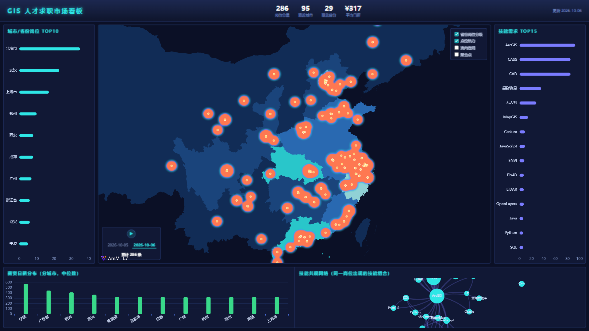

# GIS 人才求职市场可视化大屏

基于 **500+ 条**（持续采集中）真实 GIS/测绘/遥感岗位数据的求职市场看板：
PostGIS 空间数据库 → Express API → AntV L7（WebGL）时空可视化 → DataV 风格大屏，一键看清
**地信岗位在哪、要什么技能、给多少钱**。



## 在线演示

- 静态版（GitHub Pages）：本仓库 README 发布后启用，数据随采集批次更新
- 本地全栈版：见下方「快速开始」

## 功能

- **省级分级统计图**：岗位越多颜色越深（服务端聚合 + 省界 GeoJSON join）
- **点位热力图**：WebGL 核密度渲染，看清城市内部聚集（光谷、张江…）
- **流向连线**：各城市向产业集聚地的岗位规模弧线（示意语义，见数据说明）
- **聚合点**：可点击查看每个岗位的公司/薪资/技能
- **时间线动画**：按采集日期重放岗位"生长"过程
- **技能需求榜 + 技能共现网络**：市场用脚投票的技能榜（ArcGIS/CAD/CASS 领跑）与技能组合图谱
- **薪资分布**：分城市/岗位类型的日薪中位数（PostgreSQL `percentile_cont` 库内计算）
- 四个地图图层均可独立开关叠加

## 架构

```
采集（定向爬虫 + AI 辅助检索，脱敏清洗）
        │ JSON
        ▼
ETL（Python：去重 / 薪资结构化 / 高德地理编码三级定位 / GCJ-02→WGS-84）
        │
        ▼
PostgreSQL 16 + PostGIS 3.6（geom 4326 空间分析，lng/lat GCJ-02 展示）
        │
        ▼
Express API（8 端点：GeoJSON 直出、percentile_cont 箱线、unnest 技能共现、流向计算）
        │
        ▼
Vue3 + Vite + AntV L7 + ECharts 大屏
        └── 纯静态模式：API 不可用时自动回退构建期导出的静态 JSON（GitHub Pages 部署）
```

双坐标系设计：PostGIS `geom`(WGS-84/4326) 做空间分析（`ST_DWithin` 等），`lng/lat`(GCJ-02)
与高德底图、DataV 省界对齐，转换只在 ETL 发生一次。

## 快速开始（本地全栈）

依赖：Node 18+、PostgreSQL 16 + PostGIS 3、Python 3.10+

```bash
# 1. 数据库（连接串放项目根 .env，见 .env.example）
psql -U postgres -c "CREATE DATABASE gisjobs;"
psql -U postgres -d gisjobs -f db/init.sql

# 2. ETL：采集数据 -> 清洗 -> 入库（需要高德 Web服务 Key 做地理编码）
cd etl && pip install -r requirements.txt
python pipeline.py        # AMAP_KEY=xxx python pipeline.py
python load_db.py

# 3. API + 大屏
cd ../server && npm install && node index.js    # :3111
cd ../web && npm install && npm run dev         # :5173
```

Windows 下可直接双击 `start_dashboard.bat`（前提：`.env` 与数据库已就绪）。

## 数据说明与免责声明

- 数据来自公开招聘平台（BOSS直聘、智联、测绘英才网、牛客、公司官网等）的**公开信息**，
  仅用于学习研究，不做商业用途；源链接保留在每条记录（`source_url`）中
- 联系人手机号等个人信息在入库前自动脱敏（`etl/pipeline.py`）
- 流向连线是**示意语义**（非头部城市 → 省内最大集聚地 / 最近头部城市），不代表真实求职流向
- 如相关方认为数据使用不妥，请提 Issue，核实后移除

## Roadmap

- [ ] OSM → MBTiles → tileserver-gl 自托管底图（替换内置底图）
- [ ] 多期采集滚动（岗位增长时间线的真实多期数据）
- [ ] 自然语言查询入口（"武汉有哪些 OpenLayers 的实习？"→ 空间 SQL + 地图联动）
- [ ] Docker Compose 一键部署

## 技术要点（面试预演）

1. **为什么 PostGIS**：GiST 空间索引 + `ST_DWithin` 球面距离，"光谷 10km 内岗位"一条 SQL；
   MySQL 空间扩展函数与索引能力均不足
2. **GCJ-02 / WGS-84 双轨制**：国内 WebGIS 绕不开的坐标系问题——分析用 4326、展示用 GCJ-02，
   边界 GeoJSON 选 DataV（基于高德，GCJ-02）实现零转换对齐
3. **静态化部署**：`server/export-static.mjs` 把 API 结果导出为静态 JSON，前端探测 API 失败
   自动回退——同一份代码支持全栈与纯静态两种部署
